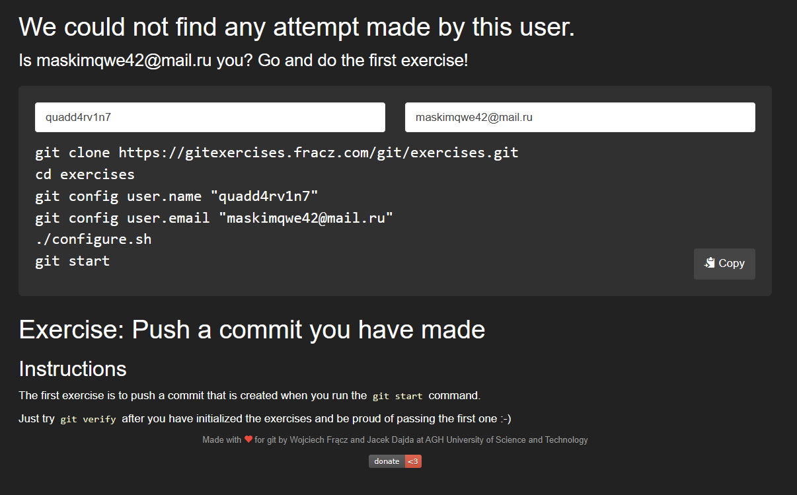

<<<<<<< HEAD
# Git Exercises

This repository contains a series of exercises to practice and improve your `Git skills`

The exercises are designed to be completed in sequence, building your confidence as you progress.

**Автор:** Дуплей Максим Игоревич

**Дата:** 21.12.2024
=======
## Push a commit you have made

The first exercise is to push a commit that is created when you run the `git start` command.

Just try `git verify` after you have initialized the exercises and be proud of passing the first one :-)

>>>>>>> e457994c542f9c68a13afa3014302697bc52bc4b
