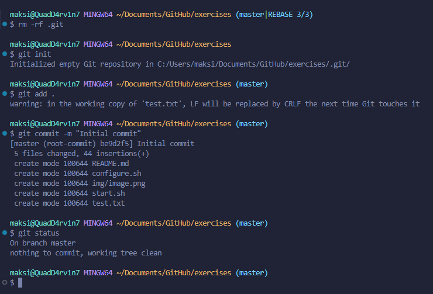

# Git Exercises

This repository contains a series of exercises to practice and improve your `Git skills`

The exercises are designed to be completed in sequence, building your confidence as you progress.




## Getting Started

**Follow these steps to initialize and start working on the exercises:**

1. **Clone the repository:**
   ```bash
   git clone https://gitexercises.fracz.com/git/exercises.git
   cd exercises
   ```

2. **Configure your `Git` `username` and `email`:**
   ```bash
   git config user.name "Maxim Dupley"
   git config user.email "maksimqw42@mail.ru"
   ```

3. **Run the `configuration` `script`:**
   ```bash
   ./configure.sh
   ```

4. **Start the first exercise:**
   ```bash
   git start
   ```

5. **Verify your progress:**
   ```bash
   git verify
   ```

## Author

**Maxim Dupley**  
Email: [maksimqw42@mail.ru](mailto:maksimqw42@mail.ru)

**Date:** 21.12.2024